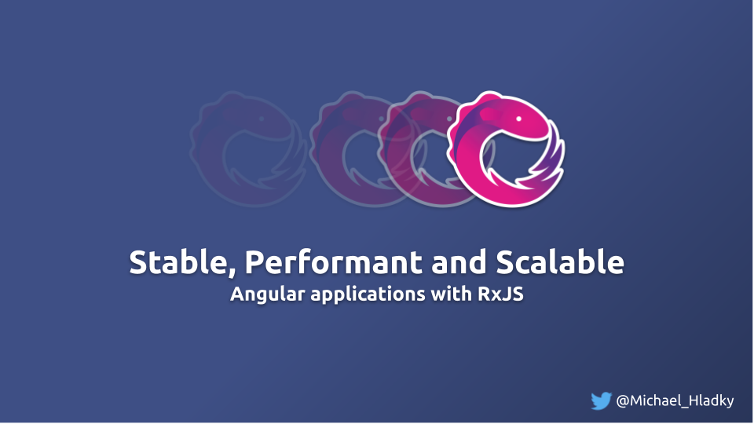

<!-- Course Image -->

<!-- Course Title -->
# Reactive Architecture and UX Patterns

<!-- Course Tagline -->
#### Getting the tools and understanding to craft fully reactive angular applications!

<!-- Course Description -->

<!-- Course Description Intro Images -->

<!-- Course Description Text -->

## Overview

Welcome to my course! My name is Michael and I will lead you through this content.

The title of this course is reactive architecture and UX patterns.
As those are pretty broad terms let be elaborate a bit on the scope and target audience.

## Level of this Course

First the level. For this course, you definitely need some fundamental knowledge about RxJS,
 and you should use it regularly in your Angular projects.
General terms like subscription handling, multi-casting, or hot/cold Observables should at least ring a little bell.

If this is not the case no big deal. As this, in an online course, you can consume it as fast or slow as you like.
It's all about fun and explores new things, so the most important to enjoy it! :)

## Content and Learning Goals

This course starts with the fundamentals of the different operator groups we will use,
and points out some interesting details.

With that in mind, we will start to work on our first patterns.

Exercises we will master are:
- Combining streams
  - Overview of combination the operators
  - Deriving state from HTTP calls
  - Prevent over fetching with simple Http Caching
  - Editing and user-controlled  opt-In updates
  - Optimize View updates and  Performance
  - Comparison of the combination patterns
-  Reactive State-Management    
  - State aggregation
  - Model vs ViewModel
  - Sharing state and instances
  - Lazyness and component initialization
  - Immutability and gotchas in operators
- Higher-Order Operators
  - Overview of the different flattening operators
  - Avoid race-conditions and over-fetching in UIs
  - HTTP optimization strategies 
- Resilience and Error-Handling
  - Error handling operators overview
  - How to encapsulate error-prone code
  - Load balancing  and polling
  - Offline friendly and exponential backoff
  - Comparison of the different retry & repeat mechanisms

Let’s jump right in and start with the first section.
