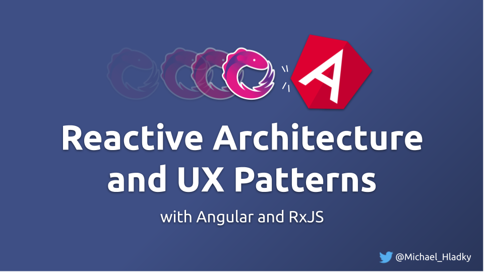
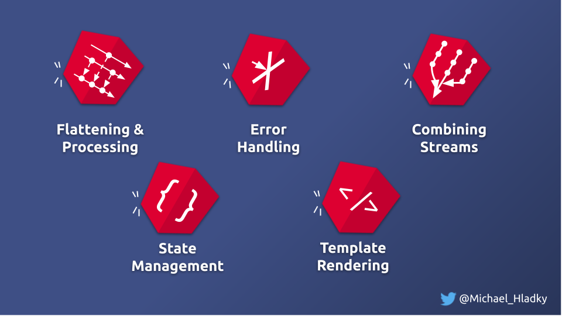

<!-- Course Image -->

<!-- Course Title -->
# Reactive Architecture and UX Patterns

<!-- Course Tagline -->
#### Getting the tools and understanding to craft fully reactive angular applications!

<!-- Course Description -->

<!-- Course Description Intro Images -->

<!-- Course Description Text -->
## Overview

Welcome to my course! My name is Michael and I will lead you through this course.

The title of this course is reactive architecture and UX patterns.
As those are pretty broad terms let be elaborate a bit on the scope and target audience.

### Level of this Course

First the level. For this course, you definitely need some fundamental knowledge about RxJS,
 and you should use it regularly in your Angular projects.
General terms like subscription handling, multi-casting, or hot/cold Observables should at least ring a little bell.

If this is not the case no big deal. As this, in an online course, you can consume it as fast or slow as you like.
It's all about fun and explores new things, so the most important to enjoy! :)

### Content and Learning Goals

This course starts with the fundamentals of the different operator groups we will use,
and points out some interesting details.

With that in mind, we will start to work on our first patterns.

Exercises we will master are:
- Deriving state and combination operators
  - Overview of combination the operators
  - HTTP fetching and with `forkJoin`
  - Avoid over-fetching by introducing state into our Http service  
  - Continuously deriving state with `combineLatest` 
  - Reduce computations and understand data normalization
  - Opt-In Updates and `withLatestFrom`
- Reactive State-Management
  - State aggregation
  - State selection
  - Architecture Patterns
- Higher-Order Observables
  - Overview of the different flattening strategies (merge, concat, exhaust, switch)
  - Usage in the user Interface
  - Usage in business logic or data layer interaction like effects/epic of REDUX
- Error-Handling
  - In-depth understanding of error handling
  - How to encapsulate error-prone code
  - Comparison of the different retry & repeat mechanisms

Let’s jump right in and start with the first section.
