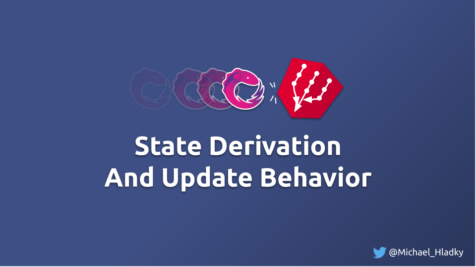

# Combining Stream and Behavior



This set of lessons is all about combination operators. 
As this course focuses on real-life use cases,  
we will use these operators in the context of state derivation, data fetching and update behavior.

We will start with some snippets of code people normally use.  
With our examples we will run into some problems with that simple approaches. 

As we go, we learn how to solve them, 
introduce more robust patterns and finally know all the does and donts of deriving state with combination operators. 


## Combination Operators - Operator Matrix

To get a better understanding of the operators in that group we create a matrix.
The operator matrix is something I came up with to show the relations of the different 
operators to each other and the similarities in behavior. 

| creation       | creation       |  operator         | operator    |
|----------------|----------------|-------------------|-------------|
| combineLatest  | forkJoin       | combineLatestWith | combineAll  |
| zip            |                | zipWith           | zipAll      |
|                |                | withLatestFrom    |             |

## Combination Operators - Algebraic approach

Another learning too I use, to teach people a more efficient learning of operators is the "Algebraic approach".
I named it that way because it borrows concepts and thinking from one of the broad parts of mathematics, [Algebra](https://en.wikipedia.org/wiki/Algebra).

> Literally translated Algebra means "reunion of broken parts".

Understanding the different operators in terms of their "broken parts" is unequally more efficient and intuitive than learning them one by one based on their name.

The list of broken parts from the above set looks like this:
`combineLatest`, `forkJoin`, `zip`, `withLatestFrom`, `With`, `All` 

If we understand every of those "broken parts" we are intuitively able to understand their "reunion", meaning the operators itself.

## Combination Operators - Exercise walk through

In order to showcase the different capabilities and constraints of the combination operators we will create a very 
simple Blog application. `Post` & `Comment` are the actual entities which can be fetched from service endpoints.
The combination operators will be used to combine `Post` & `Comment` to `BlogPost`.

```Typescript
// entity
interface Post {
    id: string;
    title: string;
    content: string;
}
// entity
interface Comment {
    id: string;
    postId: string;
    text: string;
}
// derivation
interface BlogPost { 
    id: string;
    title: string;
    comments: Comment[];
    commentCount: number;
}
```

Within this set of lessons we will walk through the following exercises:

- [ ] `forkJoin` -> `http-service-v1`
  - We start with a very simple list example where we derive data in our component directly over HTTP requests by using `forkJoin`
  - List is not "reactive" in terms of "adding/updating" -> build a refetch
  - We notice that this architecture results in HTTP over-fetching -> introduce simple state -> forkJoin vs. combineLatest
- [ ] `combineLatest`
  - To solve it we refactor the give HTTP service to get more control over when we fetch the data
  - this reviles one of the special behaviours of `forkJoin` and we need to rethink it usage
  - http-service-v1
- [ ] We learn the difference of `forkJoin` and `combineLatest` 
  - this knowledge helps us to refactor the service and component.
  - combineLatest
- [ ] As we go we start to introduce more features into our UI
   - again we run into a problem, this time over-rendering.
   - zip
- [ ] As it was quite technical so far we learn about `withLatestFrom` with a more playful example 
  - by doing so we understand the concept of `promary` and `secondary` streams
  - withLatestFrom
- [ ] With a fresh and open mine we think about those concepts in combination with a UX Pattern called `opt-in updates`
  - to give a better experience to our users we implement this pattern in our example
  


