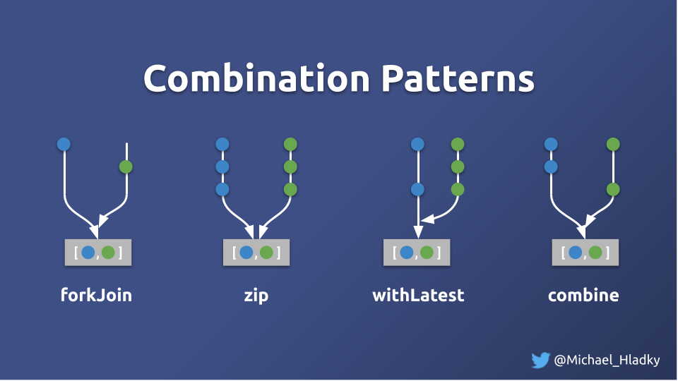

# Combining Stream and Behavior

- forkJoin => 2 http in component => Problem: over-fetching because http in component => 
- Http Service refactor to obs$ in service => forkJoin needs complete => intro combineLatest
- combineLatest =>theory => calculate with independent values => Intro num of Items in comp => over-rendering => 1 update 2 emissions
- zip for dependent state calculation values
- withLatestFrom => left right example => 
- opt-in example -> vanilla -> material-dialog

