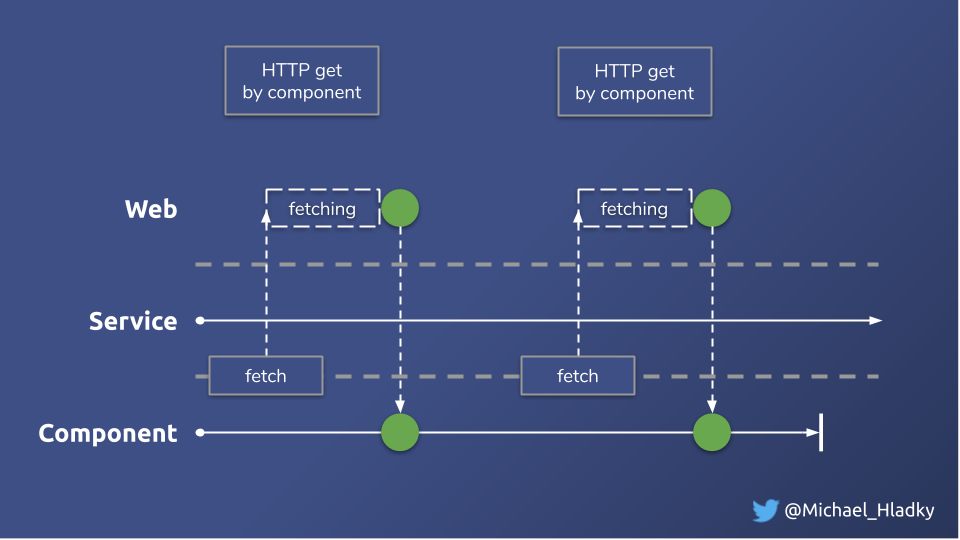
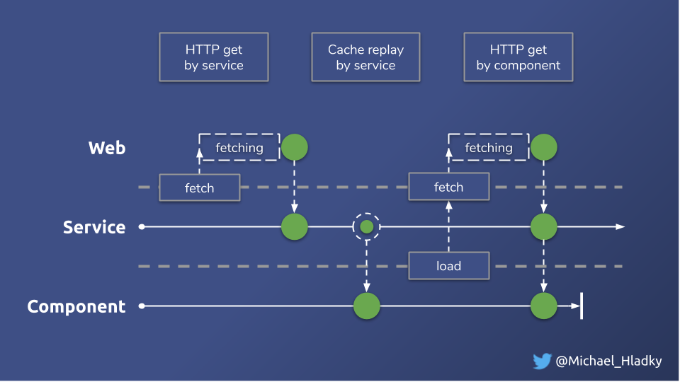

# Combining ongoing Observables - Exercise

## Intro
Processing HTTP calls directly in the component without any caching approaches will quickly result in _over-fetching_.
We request data from the server more often than we need to.

_Over-fetching HTTP requests visualized_


This is a result of wrong state-management. To face this problem, we need to store the results of the HTTP Requests in
a shared cache. We can put this behavior inside a `Service` in order to share our state accross multiple `Components`.

_Shared data store visualized_


For this exercise we introduce a very basic HTTP cache solution by using a `BehaviorSubject` as a shared data store. Instead
of binding `Components` directly to HTTP Requests, we will feed the data store with the results and provide
 single shared `Observables` mapped from the data store. 

**Service**
```Typescript
// combine-latest-blog.service.ts

private readonly state$ = new BehaviorSubject<BlogServiceState>({
    posts: [] as Post[],
    comments: [] as Comment[]
}); 

readonly posts$ = this.state$.pipe(map(s => s.posts)); // shared and replayed observable posts
readonly comments$ = this.state$.pipe(map(s => s.comments)); // shared and replayed observable comments

// ...

fetchPosts() {
    this.httpGetPosts()
      .subscribe(posts => {
        this.state$.next({
          ...this.state$.getValue(),
          posts: upsertEntities(this.state$.getValue().posts, posts, 'id')
        });
      });
}

fetchComments() {
    this.httpGetComments()
      .subscribe(comments => {
        this.state$.next({
          ...this.state$.getValue(),
          comments: upsertEntities(this.state$.getValue().comments, comments, 'id')
        });
      });
}

addPost(post: Pick<Post, 'title'>) {
    this.httpPostPost(post)
      .subscribe((newPost) => {
        console.log('saved ', newPost , 'to the server');
        this.state$.next({
          ...this.state$.getValue(),
          posts: upsertEntities(this.state$.getValue().posts, [newPost], 'id')
        })
      }, console.log);
}
```

We also initially fetch the posts and comments from the server when the service gets initiated.

**Service**
```Typescript
// combine-latest-blog.service.ts

// ...
constructor(...) {
    this.fetchPosts();
    this.fetchComments();
}
```

## Exercise

Eliminate the HTTP requests from the `Component` by making use of the shared Observables `posts$` and `comments$`.
Even though the data in our store gets updated properly, the `Component` won't be able to display the list of
`BlogPost` anymore.
This is because `posts$` and `comments$` do not `complete`. Since `forkJoin` relies on its sources to complete, it won't 
emit any value.

We need to replace `forkJoin` with an operator that matches the new requirements. 

`combineLatest` is perfectly suited for this case. 
Use it and see if the list of BlogPosts renders now.

Try adding a new `Post` using the "Add Post" button. ??


