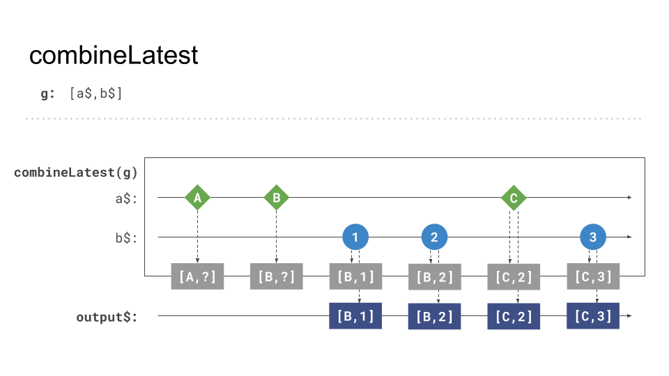

# `combineLatest` creation function - Theory

In the previous example, we learned how to combine multiple HTTP Requests into one stream with `forkJoin`.
Often operators are special forms or subforms of other operators.
If we take a look at the overview of combination patterns we realize that two of them look very similar, forkJoin, and combine.

Both combine the values of the source Observables to one emission, but `combineLatest` in comparison to `forkJoin` does not rely
on all sources to complete. Thus allowing us to process ongoing Observables. If any of the sources emit **a new value**, the
result will update to the **latest values** of each source.


_forkJoin no emission if not all complete_

An example of processing ongoing Observables with `combineLatest`:

```Typescript
import { interval, combineLatest } from 'rxjs';
import { map } from 'rxjs/operators';

const source1$ = interval(1000); // ongoing, never completing source
const source2$ = interval(1000).pipe(map(i => i * 10));

const result$ = combineLatest([source1$, source2$]);
result$
  .subscribe((result) => {
    console.log(result) // [0,0], [1, 10], [2, 20], [3, 30], ...
  })        
```

## Behavior 


_combineLatest - inner ongoing_

`combineLatest` completes when all sources `complete`.


_combineLatest - inner complete all_

If an internal Observable errors, the resulting Observable also errors.


_combineLatest - inner error_

## 💡 Gotcha(s)!

Be careful, `combineLatest` will emit its first value after **all** sources emitted at least one value.
This can result in situations where no value ever gets emitted.

 ```Typescript
 import { interval, combineLatest, NEVER } from 'rxjs';
 import { map } from 'rxjs/operators';
 
 const source1$ = NEVER; // neither emitting, nor completing observable
 const source2$ = interval(1000); // ongoing, never completing source
 
 const result$ = combineLatest([source1$, source2$]);
 result$
   .subscribe((result) => {
     console.log(result) // will never emit any value
   })        
 ```


_combineLatest - inner complete_

Even if some sources `complete`, we are able to process future values from other ongoing Observables while keeping the
last emission of the completed ones.


_combineLatest - inner complete_

