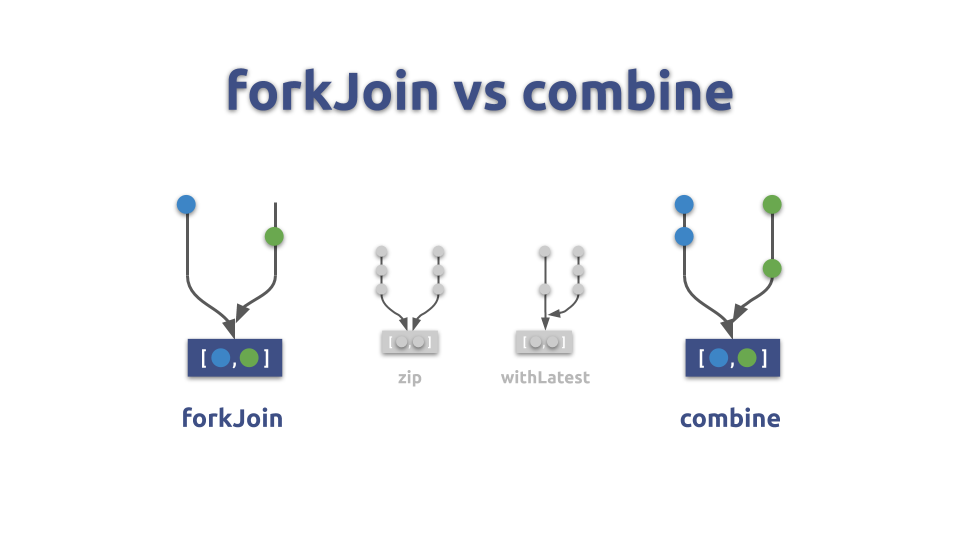
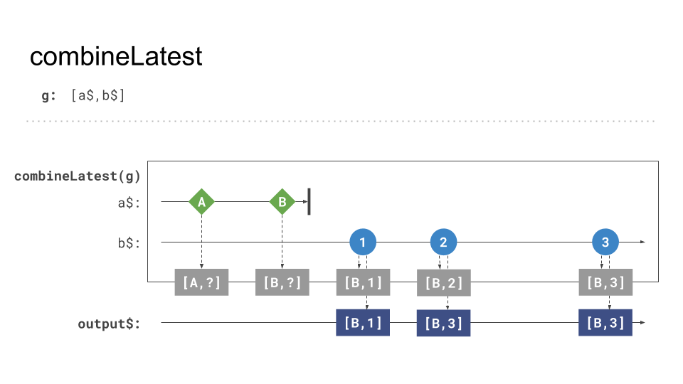
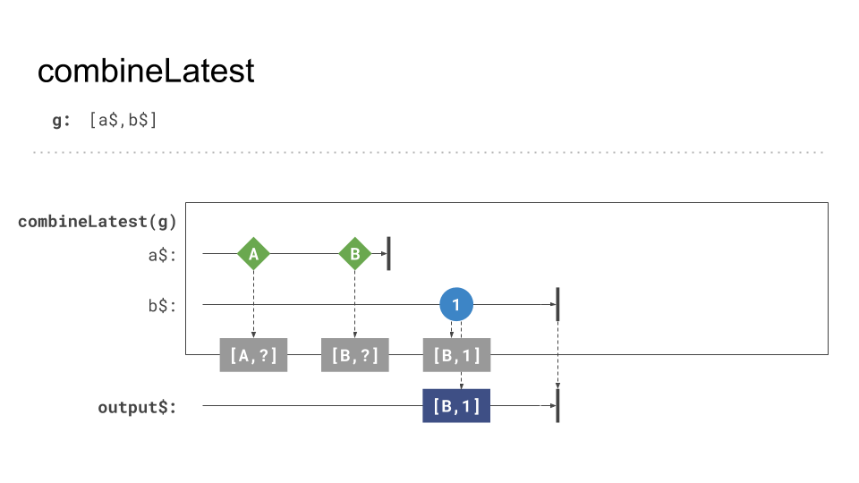

# `combineLatest` creation function - Theory

Often operators are special forms or sub forms of other operators.
If we take a look at the overview of combination patterns we realize that 2 of the look similar, forkJoin and combine.

They both process the values of the included Observables together, but `combineLatest` in comparison to `forkJoin` allows us to 
process **every new value** with the latest values of the other included Observables.



An example of processing ongoing Observables with `combineLates` looks like that:

```Typescript
import { interval, combineLatest } from "rxjs";
import { map } from "rxjs/operators";

const source1$ = interval(1000);
const source2$ = interval(1000).pipe(map(i => i * 10));

const result$ = combineLatest([source1$, source2$]);
result$
  .subscribe((result) => {
    console.log(result) // [0,0], [1, 10], [2, 20], [3, 30], ...
  })        
```


A nice behaviour here is even if one of the included Observables completes we process further values from other ongoing Observables.



Only if all included Observables complete the resulting Observable also complete.



If an internal Observable errors, the resulting Observable also errors.


