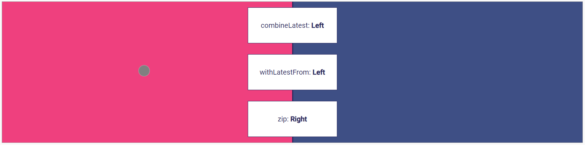

# Combination Operators Comparison - Exercise

## Intro


_Combination operators comparison - exercise_

In the start component, you will find a screen split into 2 sections.
Left and right. In the center 
we have 3 boxed displaying the result of the named strategies combine, withLatest and zip.

```html
<h1>Comparison combination operators</h1>

<div #box class="box">
  <div class="click-area"></div>
  <div class="separation"></div>
  <div class="click-pos">&nbsp;</div>

  <div class="click-result">
    combine
    {{clickResultCombine$ | async}}
  </div>
  <div class="click-result">
    withLatest
    {{clickResultWithLatest$ | async}}
  </div>
  <div class="click-result">
    zip
    {{clickResultZip$ | async}}
  </div>
</div>
```

In the components class we have the displayed observables present as Subjects:
```typescript
export class SolutionComparisonComponent implements AfterViewInit, OnDestroy {
  // ...

  clickResultCombine$ = new Subject<string>();
  clickResultWithLatest$ = new Subject<string>();
  clickResultZip$ = new Subject<string>();
```

Also, 2 Observables are already setup in the `ngAfterViewInit` hook, `clickPosX$` and `elemWith$`. 

```typescript
  ngAfterViewInit(): void {
    const clickPosX$ = fromEvent(this.boxViewChild.nativeElement, 'click').pipe(
      tap((e: any) => {
        const elem = this.elemRef.nativeElement.querySelector('.click-pos');
        elem.style.top = `${e.offsetY - 15}px`;
        elem.style.left = `${e.offsetX - 15}px`;
        elem.style.display = 'block';
      }),
      map((e) => e['offsetX'])
    );
    this.subscription.add(
      clickPosX$.subscribe(cPX => console.log('clickPosX', cPX))
    );


    const elemWith$ = fromEvent(window, 'resize').pipe(
      map(() => this.boxViewChild.nativeElement.getBoundingClientRect().width)
    );
    this.subscription.add(
      elemWith$.subscribe(w => console.log('elemWith', w))
    );

  }
```

They are already subscribed to and will forward them with our click container, and the other Observable logs the click position.

A small helper function `getSideOfClick` is provided. 

```typescript
  getSideOfClick(posX: number, width: number): string {
    return (width / 2) < posX ? 'Right' : 'Left';
  }
```

It takes the click position and the with of the element and calculates if the click happened ant the right or left section of the container.

## Exercise

Create an Observable with that calculates the side of the click.

Use the listed operators:

- `combineLatest`
- `combineLatestWith`
- `zip`
- `zipWith`
- `withLatestFrom`

Resize and click and see how the different operators behave.
