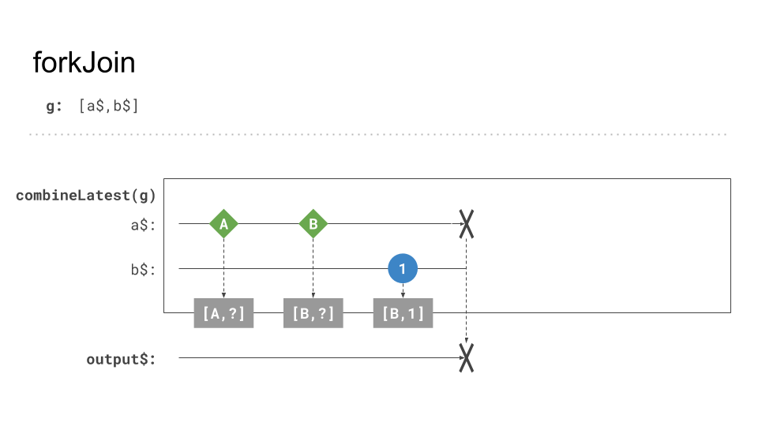
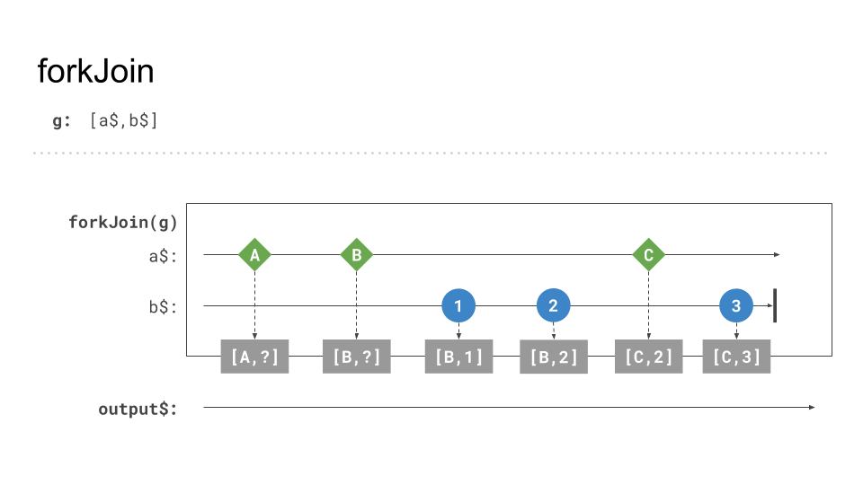

# forkJoin behavior and gotchas

This exercise is about combining data coming from multiple HTTP Endpoints into one single set of data.
Combination operators or creation functions enable us to process emissions 
from different `Observables` and transform them into a single emission.
The resulting value is an array with the last emitted value of all included Observables.

In this very exercise, we will utilize the `forkJoin` operator. 
At first sight, it is a perfect match for combining HTTP Requests since it waits until all
combined operators `complete` before emitting a result.

## Behavior

The below example showcases a very simple case using the `forkJoin` operator. 
We make use of the `of` creation function (passing a single value), as its emission pattern is very similar to an HTTP request.
It emits one single value and completes.

```Typescript
import {forkJoin, of} from 'rxjs';

const source1$ = of('A'); // of emits and completes instantly
const source2$ = of(1);

const result$ = forkJoin([source1$, source2$]);
result$
  .subscribe(([resultA, result1]) => { // access results in the original order
    console.log(resultA); // 'A'
    console.log(result1); // 1
  })        
```
The visual representation of the above example:
The gray boxes at the bottom of the operator scope symbolize a cache which stores the last emitted value of each included Observable. 


_forkJoin http calls_

If any of the sources raises an `error`, it gets forwarded, and the resulting Observable errors.


_forkJoin error_

## 💡 Gotcha(s)!

As stated above, the `forkJoin` creation function waits until every source raises a `complete` event. After that, it will return the very *last* value of each source. It suits perfectly fine when dealing with HTTP Requests since they `complete` on their own.
 However, there are many situations where this behavior is unwanted. 
 
 This example shows how `forkJoin` only emits the last value after all sources `completed`.


_forkJoin all complete last_

 Here you can see how `forkJoin` will never emit any value because `a$` does not `complete`.


_forkJoin no emission if not all complete_
