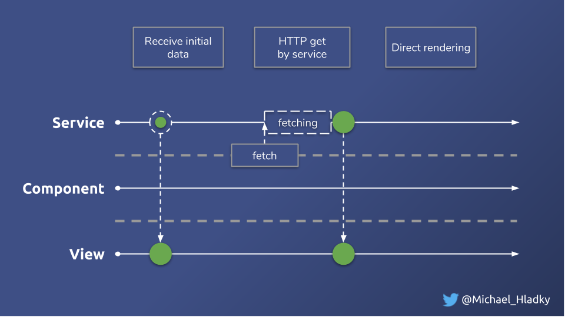
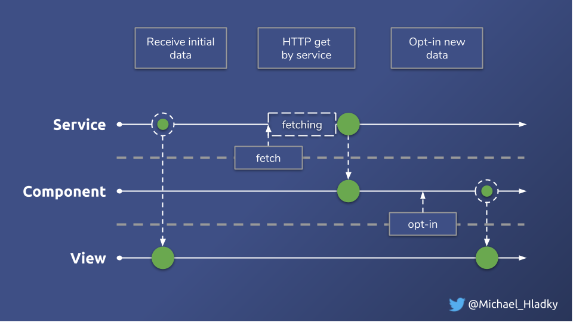

# Opt-in updates - Exercise

## Intro
Now that we've learned how to efficiently handle data coming from multiple HTTP Endpoints we can move on and
 tackle more complex scenarios. Our current solution displays data whenever it arrives (_instant updates_).
 
However, there will be situations where you want to _stage_ incoming data before actually render them.
Imagine a message feed like _twitter_ where new arriving _tweets_ first inform the user about updates before actually updating 
the feed. 
In this scenario, users are able to _opt-in_ for updates.

_current solution: instant updates visualized_


_desired solution: opt-in updates visualized_


For this exercise we have to extend our `Component` with extra functionalities.

```Typescript
@Component()
export class StartWithLatestFromComponent {
  optInListClick$ = new Subject(); // performs the opt-in update on button click
  numNewItems$: Observable<number>; // the derived number of new items available for display
  feed$: Observable<BlogPost[]>; // the new feed to display. use blog$ and optIntListClick$ to calculate
}

```

## Exercise

Utilize the `withLatestFrom` combination operator and implement a _staging_ area for new arriving `BlogPost`.
Use the new introduced properties `optInListClick$`, `numNewItems$` and `feed$` to implement your solution. You should
end up replacing the view binding of `blog$` by `feed$`. Use `blog$` and `optInListClick$` to calculate the new feed.
