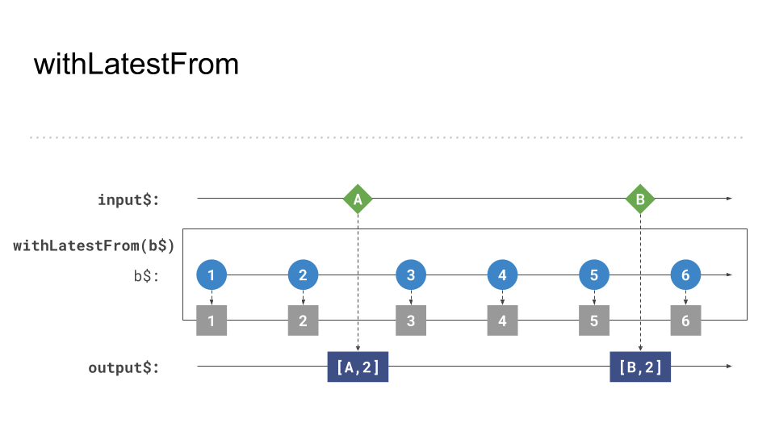

# withLatestFrom behavior and gotchas

The previous example showcased how to combine multiple ongoing `Observables` to one result. However, there are
situations where it is necessary to access the latest value from an `Observable` after a specific event occurs.

`withLatestFrom` combines the last _emitted_ value of the provided source `Observable` to an active stream of data.

We will utilize the `withLatestFrom` operator in this exercise to set up a _staging_ area for new incoming `BlogPost` 
in order to achieve user controller opt-in updates for the view.

## Behavior 

An example where the latest value of `b$` is logged after a user clicks on the document.
```Typescript
import { fromEvent, interval } from 'rxjs';
import { withLatestFrom } from 'rxjs/operators';

const input$ = fromEvent(document, 'click'); // get the click event
const b$ = interval(1000);
const result = input$.pipe(withLatestFrom(b$));
result.subscribe(([clickEvent, latestTimerValue]) => console.log(latestTimerValue)); // logs the latest value of the timer
```

_The visual representation of this example_

If the _outer_ `Observable`, you originally subscribed to, or the _inner_ `Observable` which you applied `withLatestFrom`
to raises an `error`, the end result will be an `error` too.

_withLatestFrom outer error_


_withLatestFrom inner error_

If the `Observable` within `withLatestFrom` raises a `completion` event, the stream will continue using the last emitted 
value of the source.


_withLatestFrom inner complete_

## 💡 Gotcha(s)!

`withLatestFrom` will only emit values if the provided source ever emitted a value.
The following illustration visualizes this behavior. Even though `input$` emits `A` and `B`, the `subscriber` doesn't get
notified about the changes.

_withLatestFrom waits until at least one value was emitted_
