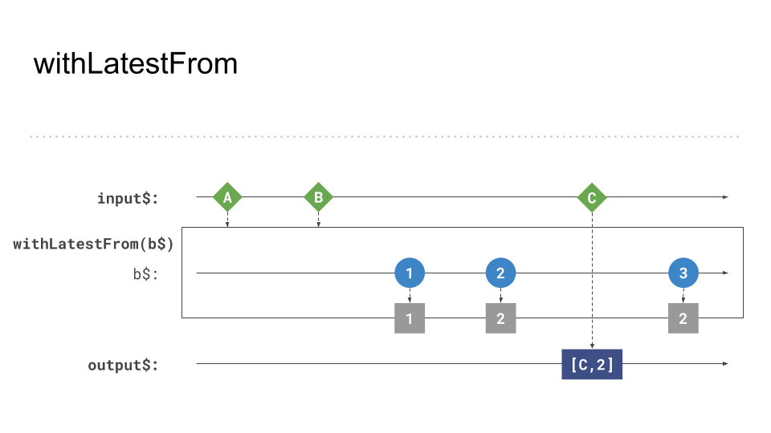

# Opt-in updates - Theory

The previous example showcased how to combine multiple ongoing `Observables` to one result. However, there are situations
where it is necessary to access the latest value from an `Observable` after a specific event occurs.

`withLatestFrom` combines the last _emitted_ value of the a provided source `Observable` to an active stream of data.

In this example we want to get the latest value of the `timer$` whenever a user clicks on the document.
```Typescript
import { fromEvent, interval } from 'rxjs';
import { withLatestFrom } from 'rxjs/operators';

const click$ = fromEvent(document, 'click'); // get the click event
const timer$ = interval(1000);
const result = click$.pipe(withLatestFrom(timer$));
result.subscribe(([clickEvent, latestTimerValue]) => console.log(latestTimerValue)); // logs the latest value of the timer
```




Gotcha => startWith
