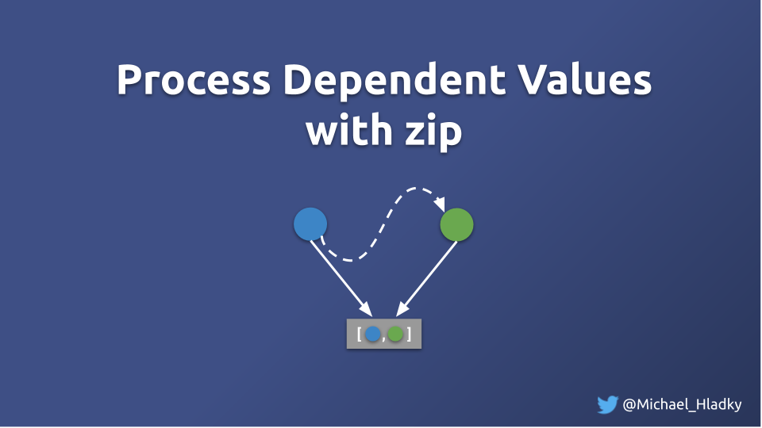
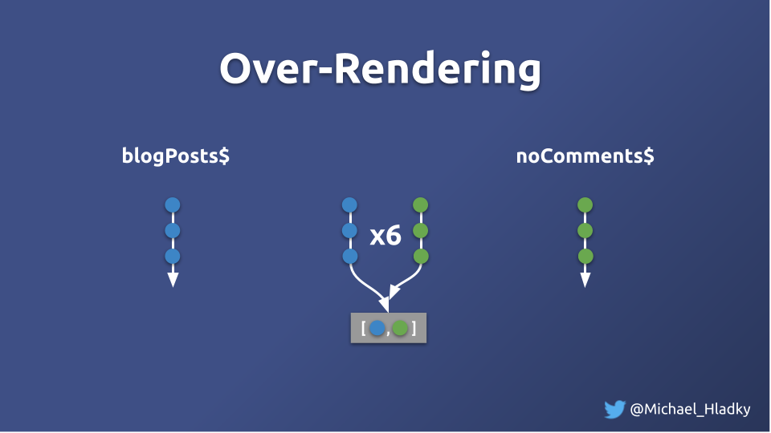

# Processing dependent values - Exercise



## Intro

Our project got some updates, and we now display 2 lists.

On the left all blog post and on the right only the blog post with comments: 
```html
 <div class="row">

    <div style="width: 49%" *ngIf="blog$ | async as list">
      <b>All items</b>
      <mat-list>
        <mat-list-item *ngFor="let item of list">
          {{item.title}} - Comments: {{item.commentCount}}
        </mat-list-item>
      </mat-list>
    </div>


    <div style="width: 49%" *ngIf="commentedPosts$ | async as likedItems">
      <b>Liked items</b>
      <mat-list>
        <mat-list-item *ngFor="let item of likedItems">
          {{item.title}} - Comments: {{item.commentCount}}
        </mat-list-item>
      </mat-list>
    </div>
  </div>
```

We are asked to improve the number of processing in this component and introduce counter properties in our class to enumerate the rendering.

```Typescript
  // Counter properties
  numProcessJoinedList = 0;
  numRenders = 0;
  numProcessLikedList = 0;
  
  // All blog posts 
  blog$ = combineLatest([
    this.blogPostService.posts$,
    this.blogPostService.comments$
  ]).pipe(
    map(([list, items]) => toBlogPosts(list, items)),
    tap(v => ++this.numProcessJoinedList)
  );

  commentedIds$ = this.blog$.pipe(
    map(list => list
      .filter(item => item.commentCount > 0)
      .map(item => item.id)
    )
  );

  // Only commented blog posts 
  commentedPosts$: Observable<BlogPost[]> = combineLatest([
    this.blog$,
    this.commentedIds$
  ])
    .pipe(
      map(([mergedList, likedIds]) => (mergedList.filter(i => likedIds.find(li => li === i.id)))),
      tap(v => ++this.numProcessLikedList)
    );

  constructor(public blogPostService: ZipBlogService) {
    this.blogPostService.fetchPosts();
    this.blogPostService.fetchComments();
  }
```

To get a cleaner picture of is happening we also render the values in the component:

```typescript
@Component({
  selector: 'zip',
  template: `
  ...
  <p><b>renders: {{renders()}}</b></p>
  <p><b>processJoinedList: {{processJoinedList()}}</b></p>
  <p><b>processLikedList: {{processLikedList()}}</b></p>
  ...
  `,
})
export class StartZipComponent {

  numProcessJoinedList = 0;
  numRenders = 0;
  numProcessLikedList = 0;

  processJoinedList() {
    return this.numProcessJoinedList;
  }

  renders() {
    return ++this.numRenders;
  }

  processLikedList() {
    return this.numProcessLikedList;
  }
}
```

When clicking on the add button we realize the component is over-rendering, as the numbers are increasing un-proportionally to the data we receive.



## Exercise

Try to implement operators that filter out values which should not get processed. e.g. empty arrays are not interesting to process.
also, if multiple subscriptions get done on the same Observable we could try to share the processed result with all subscribers to reduce the number of processing.

Also consider where and if `zip` could help here.
