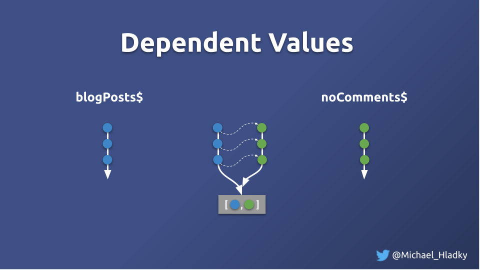
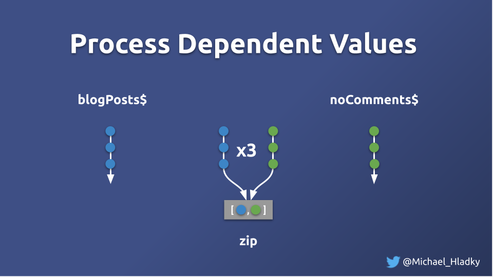

# Processing dependent values - Solution

As a measure we take the:
- Numbers of processing for bootstrapping
- Numbers of processing for new data

Initial measure:

**Numbers of processing for bootstrapping:**
renders: 6
processJoinedList: 27
processLikedList: 17

**Numbers of processing for new data:**
renders: 8 (Δ2)
processJoinedList: 33 (Δ6)
processLikedList: 21 (Δ4)


As a first step to the solution we introduced filter operators that 
swallow empty arrays caused by non-lazy state management to improve the numbers.

```typescript
blogs$ = combineLatest([
    this.blogPostService.posts$.pipe(filter(list => !!list.length)),
    this.blogPostService.comments$.pipe(filter(list => !!list.length))
])
```

**Numbers of processing for bootstrapping:**
renders: 5 (-1)
processJoinedList: 15 (-12)
processLikedList: 9 (-8)

**Numbers of processing for new data:**
renders: 7 (Δ2 => ~) 
processJoinedList: 21 (Δ6 => ~)
processLikedList: 13 (Δ4 => ~)

As `blogs$` is used multiple times we share the processed values over the `share` operator.
```typescript
blogs$ = combineLatest([
    this.blogPostService.posts$.pipe(filter(list => !!list.length)),
    this.blogPostService.comments$.pipe(filter(list => !!list.length))
  ])
  .pipe(
    map(([list, items]) => toBlogPosts(list, items)),
    tap(v => ++this.numProcessJoinedList),
    share()
  );
```

**Numbers of processing for bootstrapping:**
renders: 5 (-1)
processJoinedList: 5 (-22)
processLikedList: 9 (-8)

**Numbers of processing for new data:**
renders: 7 (Δ2 => ~) 
processJoinedList: 7 (Δ2 => -4)
processLikedList: 13 (Δ4 => ~)

These improvements didn't change the way of processing it but still gave us a huge performance boost.

Another thing we could think of is to analyze the relations of the processed Observables. 
We see that `blogPosts$` hast a relation to `commentedIds$`, or in other words `commentedIds$` is a derivation of `blogPosts$`.



`commentedBlogPosts$` needs to process `blogPosts$` and `commentedIds$` in pairs. This helps to avoid irrelevant processing.




Let's implement `zip` and see the new numbers. 

```typescript
commentedBlogPosts$: Observable<BlogPost[]> = zip(
    this.blogPosts$,
    this.commentedIds$
)
    .pipe(
        map(([mergedList, likedIds]) => (mergedList.filter(i => likedIds.find(li => li === i.id)))),
        tap(v => ++this.numProcessLikedList)
    );
```

**Numbers of processing for bootstrapping:**
renders: 5 (-1)
processJoinedList: 5 (-22)
processLikedList: 5 (-12)

**Numbers of processing for new data:**
renders: 7 (Δ2 => ~) 
processJoinedList: 7 (Δ2 => -4)
processLikedList: 7 (Δ2 => -2)

Pretty good! :D

## Conclusion

We could get rid of most of the emissions by filtering out empty values and using share.
The last tweaks where done by understanding the data structure relations 
e.g. `commentedIds$` is a derivation of `blogPosts$`.

This interesting fact opens a new chapter for us, managing data structures and derivations.  

In further exercises we will understand those concepts and avoid the targeted problem of over-rendering id a better more scalable and productive way.
