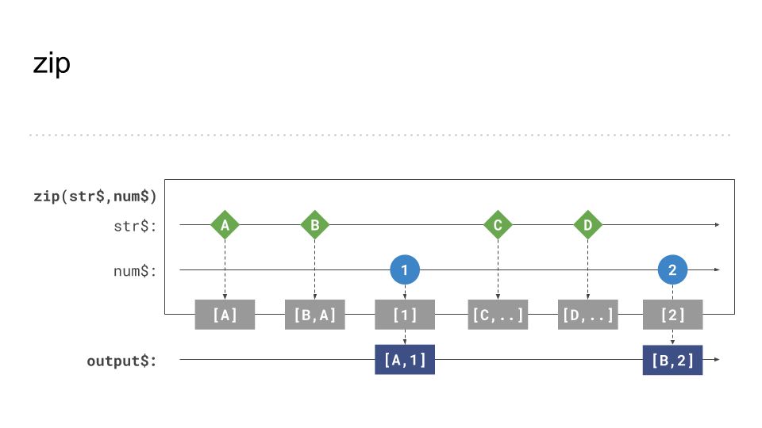
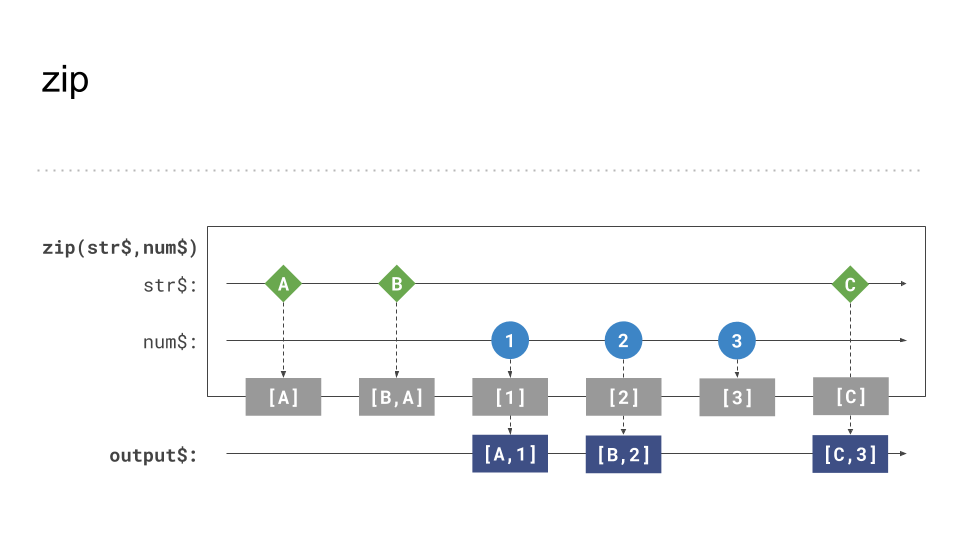
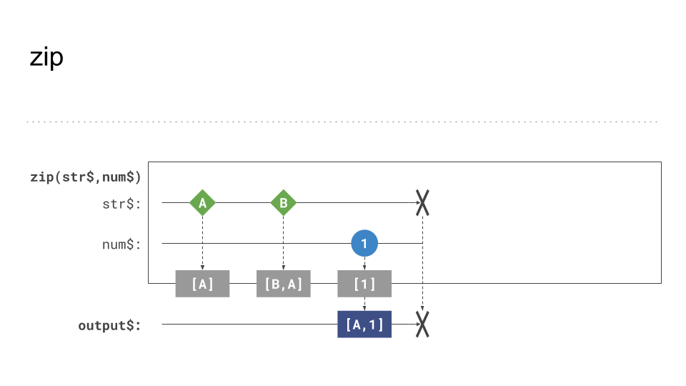
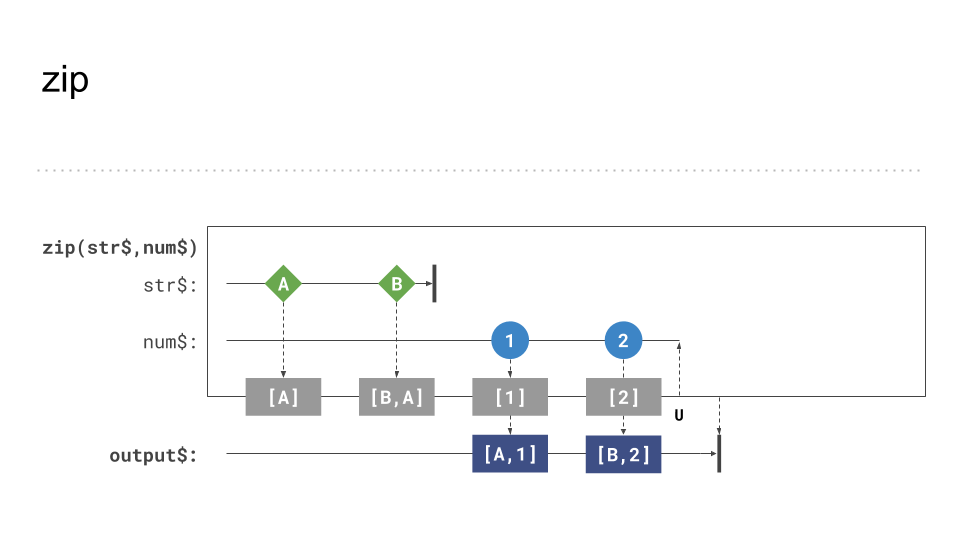
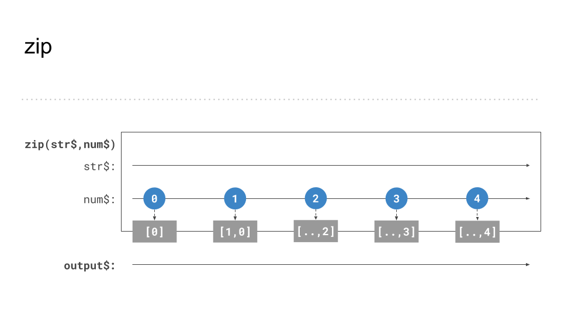
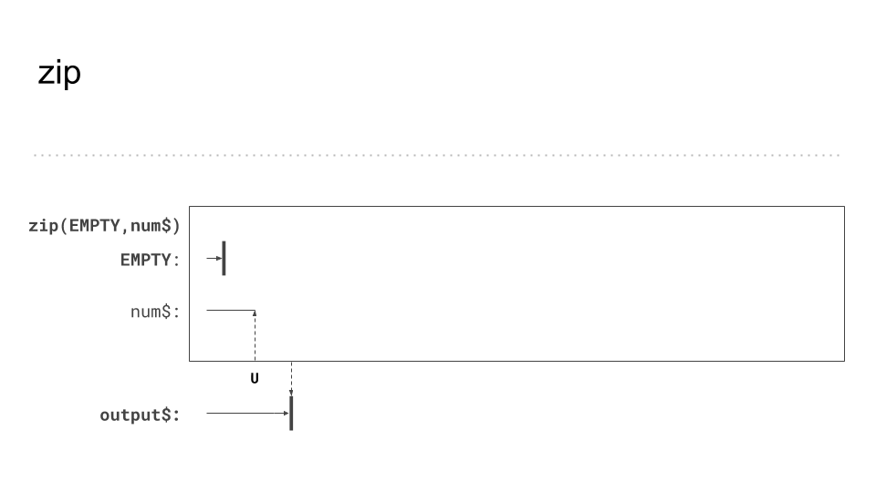

# zip behavior and gotchas

So far we have applied and discussed several operators to combine _independent_ `Observable` sources to a single stream. The `zip` operator combines
multiple sources as well. Instead of managing them independently, the result is calculated in order.

## Behavior 

`zip` waits for each source emitting a value and combines the result to a single output.
 
 ```Typescript
 import { zip, of } from 'rxjs';
 import { map } from 'rxjs/operators';
  
 const age$ = of<number>(27, 25, 29);
 const name$ = of<string>('Foo', 'Bar', 'Beer');
 const isDev$ = of<boolean>(true, true, false);
  
 zip(age$, name$, isDev$).pipe(
   map(([age, name, isDev]) => ({ age, name, isDev }))
 )
 .subscribe(x => console.log(x));
  
 // outputs
 // { age: 27, name: 'Foo', isDev: true }
 // { age: 25, name: 'Bar', isDev: true }
 // { age: 29, name: 'Beer', isDev: false }
 ```

If the sources emit values at different timings, `zip` waits until every source has emitted a value for the next combined result.

```Typescript
import {interval, zip} from 'rxjs';

const input1$ = interval(200);
const input2$ = interval(1000);

const result$ = zip(input1$, input2$);
result$.subscribe(
([input1, input2]) => console.log(input1, input2)
); 
// outputs
 // 1, 1
 // 2, 2
 // 3, 3
 // 4, 4
 // 5, 5
 // n, n
```

As we can see the results get logged in correctly ordered pairs.
If one source is faster than the other, the values get cached and emitted when its related values arrive.

Here a visual representation of the above example:

_zip - different timings_

An example for random timings where `zip` still keeping the result in order

_zip - switching timings_

Errors get forwarded as in any other combination operator / function.

_zip - error forwarding_

A completion event of one source causes `zip` wait for all missing pair values and then completes.

_zip - inner complete_

## 💡 Gotcha(s)!
Be aware that `zip` can build a huge cache if emission rates are very different.
If one of the sources never emits a value you will end up with a memory leak.


_zip - never emits if one source never emits_

If on of the observables complete without any emission the operator also completes and unsubscribes from all other included Observables internally.

_zip - EMPTY results in  immediate completion_

